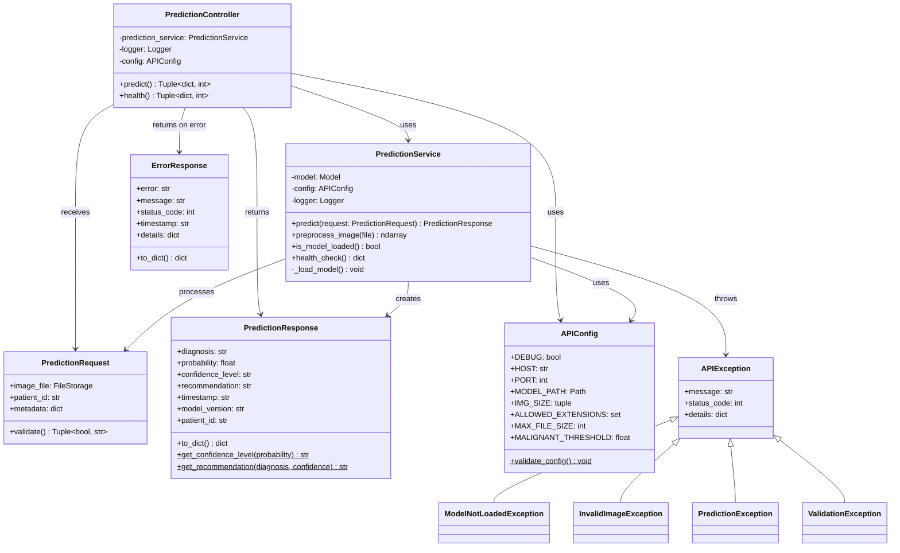

# Skin Cancer Classification API - Documentação Técnica

## 📋 Índice

1. [Visão Geral](#visão-geral)
2. [Arquitetura](#arquitetura)
3. [Endpoints](#endpoints)
4. [Modelos de Dados](#modelos-de-dados)
5. [Códigos de Status](#códigos-de-status)
6. [Exemplos de Uso](#exemplos-de-uso)
7. [Diagrama de Classes](#diagrama-de-classes)
8. [Deployment](#deployment)

---

## 🎯 Visão Geral

API RESTful para classificação de lesões de pele como benignas ou malignas utilizando Deep Learning (ResNet50 com Transfer Learning).

### Informações Básicas

- **Base URL**: `http://localhost:5000/api/v1`
- **Versão**: 1.0.0
- **Formato**: JSON
- **Autenticação**: Não requerida (versão atual)
- **Documentação Interativa**: `http://localhost:5000/docs` (Swagger UI)

### Características

- ✅ Modelo ensemble de 5 CNNs treinadas com Cross-Validation
- ✅ Arquitetura ResNet50 com Transfer Learning
- ✅ Suporte para imagens JPG, JPEG e PNG (máx 10MB)
- ✅ Retorna diagnóstico com nível de confiança
- ✅ Recomendações médicas automáticas
- ✅ Documentação Swagger/OpenAPI integrada

---

## 🏗️ Arquitetura

### Clean Architecture

```
┌─────────────────────────────────────────────────────────┐
│                    PRESENTATION LAYER                   │
│                  (Controllers - HTTP)                   │
├─────────────────────────────────────────────────────────┤
│                    APPLICATION LAYER                    │
│              (Services - Business Logic)                │
├─────────────────────────────────────────────────────────┤
│                     DOMAIN LAYER                        │
│                 (Models - DTOs/Entities)                │
├─────────────────────────────────────────────────────────┤
│                 INFRASTRUCTURE LAYER                    │
│            (Utils, Logging, Exceptions)                 │
└─────────────────────────────────────────────────────────┘
```

### Stack Tecnológica

- **Framework**: Flask 2.3.3
- **Deep Learning**: TensorFlow 2.13.0 + Keras
- **Documentação**: Flasgger 0.9.7.1
- **CORS**: Flask-CORS 4.0.0
- **Processamento de Imagem**: Pillow 10.0.0

---

## 🔌 Endpoints

### 1. POST /api/v1/predict

**Descrição**: Realiza predição de câncer de pele a partir de uma imagem.

**Headers**:
```
Content-Type: multipart/form-data
```

**Body Parameters**:

| Parâmetro | Tipo | Obrigatório | Descrição |
|-----------|------|-------------|-----------|
| `file` | File | Sim | Imagem da lesão (JPG/JPEG/PNG, máx 10MB) |
| `patient_id` | String | Não | Identificador do paciente |

**Response Success (200 OK)**:

```json
{
  "diagnosis": "benign",
  "probability": 0.2341,
  "confidence_level": "high",
  "recommendation": "Lesão aparenta ser benigna. Monitore alterações e consulte dermatologista em caso de mudanças.",
  "timestamp": "2024-01-15T10:30:45.123Z",
  "model_version": "1.0.0",
  "patient_id": "PAT001"
}
```

**Response Error (400 Bad Request)**:

```json
{
  "error": "ValidationException",
  "message": "Formato de arquivo não suportado. Use: png, jpg, jpeg",
  "status_code": 400,
  "timestamp": "2024-01-15T10:30:45.123Z"
}
```

---

### 2. GET /api/v1/health

**Descrição**: Verifica o status de saúde da API.

**Response Success (200 OK)**:

```json
{
  "status": "healthy",
  "model_loaded": true,
  "timestamp": "2024-01-15T10:30:45.123Z",
  "version": "1.0.0"
}
```

**Response Error (503 Service Unavailable)**:

```json
{
  "status": "unhealthy",
  "model_loaded": false,
  "timestamp": "2024-01-15T10:30:45.123Z",
  "version": "1.0.0"
}
```

---

### 3. GET /

**Descrição**: Informações básicas da API.

**Response (200 OK)**:

```json
{
  "message": "Skin Cancer Classification API",
  "version": "1.0.0",
  "documentation": "/docs",
  "endpoints": {
    "predict": "/api/v1/predict",
    "health": "/api/v1/health"
  }
}
```

---

## 📦 Modelos de Dados

### PredictionResponse

```typescript
{
  diagnosis: "benign" | "malignant",
  probability: number,  // 0.0 - 1.0
  confidence_level: "high" | "medium" | "low",
  recommendation: string,
  timestamp: string,  // ISO 8601
  model_version: string,
  patient_id?: string
}
```

**Campos**:

- `diagnosis`: Diagnóstico da lesão
  - `benign`: Lesão benigna (probability < 0.5)
  - `malignant`: Lesão maligna (probability >= 0.5)

- `probability`: Probabilidade da lesão ser maligna (0.0 a 1.0)

- `confidence_level`: Nível de confiança da predição
  - `high`: Alta confiança (distância do threshold >= 0.3)
  - `medium`: Média confiança (distância do threshold >= 0.2)
  - `low`: Baixa confiança (distância do threshold < 0.2)

- `recommendation`: Recomendação médica baseada no diagnóstico e confiança

- `timestamp`: Data/hora da predição em formato ISO 8601 (UTC)

- `model_version`: Versão do modelo utilizado

- `patient_id`: ID do paciente (se fornecido na requisição)

---

### ErrorResponse

```typescript
{
  error: string,
  message: string,
  status_code: number,
  timestamp: string,  // ISO 8601
  details?: object
}
```

**Campos**:

- `error`: Tipo da exceção (ex: "ValidationException")
- `message`: Mensagem descritiva do erro
- `status_code`: Código HTTP do erro
- `timestamp`: Data/hora do erro
- `details`: Informações adicionais (opcional)

---

## 🔢 Códigos de Status

| Código | Significado | Descrição |
|--------|-------------|-----------|
| 200 | OK | Requisição bem-sucedida |
| 400 | Bad Request | Requisição inválida (validação falhou) |
| 404 | Not Found | Endpoint não encontrado |
| 413 | Payload Too Large | Arquivo excede 10MB |
| 500 | Internal Server Error | Erro interno do servidor |
| 503 | Service Unavailable | Modelo não carregado |

---

## 💡 Exemplos de Uso

### cURL

```bash
# Predição
curl -X POST http://localhost:5000/api/v1/predict \
  -F "file=@lesion_image.jpg" \
  -F "patient_id=PAT001"

# Health Check
curl http://localhost:5000/api/v1/health
```

### Python (requests)

```python
import requests

# Predição
url = "http://localhost:5000/api/v1/predict"

with open("lesion_image.jpg", "rb") as image_file:
    files = {"file": image_file}
    data = {"patient_id": "PAT001"}
    
    response = requests.post(url, files=files, data=data)
    
    if response.status_code == 200:
        result = response.json()
        print(f"Diagnóstico: {result['diagnosis']}")
        print(f"Probabilidade: {result['probability']:.4f}")
        print(f"Confiança: {result['confidence_level']}")
        print(f"Recomendação: {result['recommendation']}")
    else:
        print(f"Erro: {response.json()['message']}")

# Health Check
health_response = requests.get("http://localhost:5000/api/v1/health")
print(health_response.json())
```

### JavaScript (Fetch API)

```javascript
// Predição
async function predictSkinLesion(imageFile, patientId) {
  const formData = new FormData();
  formData.append('file', imageFile);
  formData.append('patient_id', patientId);
  
  try {
    const response = await fetch('http://localhost:5000/api/v1/predict', {
      method: 'POST',
      body: formData
    });
    
    if (!response.ok) {
      const error = await response.json();
      throw new Error(error.message);
    }
    
    const result = await response.json();
    console.log('Diagnóstico:', result.diagnosis);
    console.log('Probabilidade:', result.probability);
    console.log('Confiança:', result.confidence_level);
    console.log('Recomendação:', result.recommendation);
    
    return result;
  } catch (error) {
    console.error('Erro:', error.message);
    throw error;
  }
}

// Health Check
async function checkHealth() {
  const response = await fetch('http://localhost:5000/api/v1/health');
  const health = await response.json();
  console.log('Status:', health.status);
  return health;
}

// Uso
const fileInput = document.getElementById('imageInput');
const file = fileInput.files[0];
predictSkinLesion(file, 'PAT001');
```

### React Example

```jsx
import React, { useState } from 'react';
import axios from 'axios';

function SkinCancerPredictor() {
  const [file, setFile] = useState(null);
  const [result, setResult] = useState(null);
  const [loading, setLoading] = useState(false);
  const [error, setError] = useState(null);

  const handleFileChange = (e) => {
    setFile(e.target.files[0]);
    setError(null);
  };

  const handleSubmit = async (e) => {
    e.preventDefault();
    
    if (!file) {
      setError('Por favor, selecione uma imagem');
      return;
    }

    setLoading(true);
    setError(null);

    const formData = new FormData();
    formData.append('file', file);
    formData.append('patient_id', 'PAT001'); // Opcional

    try {
      const response = await axios.post(
        'http://localhost:5000/api/v1/predict',
        formData,
        {
          headers: {
            'Content-Type': 'multipart/form-data'
          }
        }
      );

      setResult(response.data);
    } catch (err) {
      setError(err.response?.data?.message || 'Erro ao processar imagem');
    } finally {
      setLoading(false);
    }
  };

  return (
    <div>
      <h2>Análise de Lesão de Pele</h2>
      
      <form onSubmit={handleSubmit}>
        <input 
          type="file" 
          accept="image/jpeg,image/jpg,image/png"
          onChange={handleFileChange}
        />
        <button type="submit" disabled={loading}>
          {loading ? 'Analisando...' : 'Analisar'}
        </button>
      </form>

      {error && <div className="error">{error}</div>}

      {result && (
        <div className="result">
          <h3>Resultado</h3>
          <p>Diagnóstico: <strong>{result.diagnosis}</strong></p>
          <p>Probabilidade: {(result.probability * 100).toFixed(2)}%</p>
          <p>Confiança: {result.confidence_level}</p>
          <p>Recomendação: {result.recommendation}</p>
        </div>
      )}
    </div>
  );
}

export default SkinCancerPredictor;
```

---

## 📊 Diagrama de Classes



### Fluxo de Dados

```
┌──────────┐      ┌────────────┐      ┌─────────────┐      ┌───────┐
│  Client  │─────▶│ Controller │─────▶│   Service   │─────▶│ Model │
│ (Frontend│      │   (HTTP)   │      │ (Business)  │      │ (DL)  │
└──────────┘      └────────────┘      └─────────────┘      └───────┘
     ▲                   │                    │                 │
     │                   │                    │                 │
     │                   ▼                    ▼                 ▼
     │              ┌─────────┐         ┌──────────┐      ┌────────┐
     └──────────────│Response │◀────────│ Response │◀─────│Prediction
                    │  (JSON) │         │   DTO    │      │         │
                    └─────────┘         └──────────┘      └────────┘
```

---

## 🚀 Deployment

### Requisitos do Sistema

- Python 3.8+
- 4GB RAM mínimo (8GB recomendado)
- 2GB espaço em disco
- CPU: 2+ cores (GPU opcional)

### Instalação

```bash
# 1. Clonar repositório
git clone <repository-url>
cd skin-cancer-classifier

# 2. Criar ambiente virtual
python -m venv venv
source venv/bin/activate  # Linux/Mac
# ou
venv\Scripts\activate  # Windows

# 3. Instalar dependências
pip install -r requirements.txt

# 4. Configurar variáveis de ambiente (opcional)
cp .env.example .env
# Editar .env conforme necessário

# 5. Verificar modelo treinado
# Certifique-se de que existe: models/final_ensemble_model.keras
# Se não existir, execute o treinamento primeiro:
python train.py
```

### Executar API

```bash
# Desenvolvimento
python run_api.py

# Produção (com Gunicorn)
pip install gunicorn
gunicorn -w 4 -b 0.0.0.0:5000 "src.api.app:create_app()"
```

### Docker (Opcional)

```dockerfile
FROM python:3.9-slim

WORKDIR /app

COPY requirements.txt .
RUN pip install --no-cache-dir -r requirements.txt

COPY . .

EXPOSE 5000

CMD ["python", "run_api.py"]
```

```bash
# Build
docker build -t skin-cancer-api .

# Run
docker run -p 5000:5000 -v $(pwd)/models:/app/models skin-cancer-api
```

---

## ⚠️ Avisos Importantes

### Disclaimer Médico

⚠️ **IMPORTANTE**: Esta API é uma ferramenta de **auxílio diagnóstico** e **NÃO substitui** a avaliação de um profissional de saúde qualificado. 

- Sempre consulte um dermatologista para diagnóstico definitivo
- Os resultados devem ser interpretados por profissionais médicos
- Não tome decisões de tratamento baseadas apenas nesta ferramenta

### Limitações

- Modelo treinado especificamente para lesões de pele
- Requer imagens de qualidade adequada
- Performance pode variar com diferentes tipos de câmeras/iluminação
- Não detecta todos os tipos de câncer de pele

---

## 📞 Suporte

Para dúvidas ou problemas:
- Documentação Interativa: `http://localhost:5000/docs`
- Issues: [GitHub Issues]
- Email: support@skincancerapi.com

---

## 📝 Changelog

### v1.0.0 (2024-01-15)
- ✨ Release inicial
- ✅ Endpoint de predição
- ✅ Endpoint de health check
- ✅ Documentação Swagger
- ✅ Modelo ensemble ResNet50
- ✅ Suporte para JPG/PNG

---

**Última atualização**: 2024-01-15  
**Versão da API**: 1.0.0  
**Versão do Modelo**: 1.0.0
